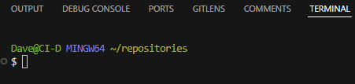
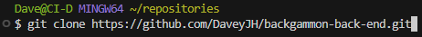
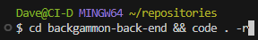
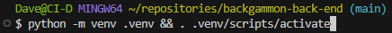

# Name of project
<!--  -->
## Live Site
<!-- [nameOfSite](siteURL)) -->
## Repository
<!-- [repoLocation](repoLocation) -->
***

## Table of Contents

- [Name of project](#name-of-project)
  - [Live Site](#live-site)
  - [Repository](#repository)
  - [Table of Contents](#table-of-contents)
  - [Objective](#objective)
  - [Brief](#brief)
    - [Tactical Rashers API](#tactical-rashers-api)
  - [UX − User Experience Design](#ux--user-experience-design)
    - [User Requirements](#user-requirements)
      - [First Time User](#first-time-user)
      - [Returning User](#returning-user)
    - [Initial Concept](#initial-concept)
  - [Features](#features)
    - [Existing Features](#existing-features)
    - [Features Left to Implement](#features-left-to-implement)
  - [Technologies Used](#technologies-used)
  - [Testing](#testing)
  - [Bugs](#bugs)
    - [Current](#current)
    - [Resolved](#resolved)
  - [Development](#development)
    - [GitHub](#github)
    - [VSCode](#vscode)
  - [Deployment](#deployment)
  - [Credits](#credits)
    - [Content](#content)
    - [Media](#media)
    - [Acknowledgements](#acknowledgements)
    - [Personal Development](#personal-development)

***

## Objective

This site is to represent capabilities with the Django Rest Framework. It should
employ full Create, Read, Update, Delete (CRUD) functionality via DRF.

The assessment checklist is available to view in the
[`docs/` directory](https://github.com/DaveyJH/ci-portfolio-five/tree/main/docs)
of the project repository.

***The needs within this project are not genuine and are made purely for the purpose of completing my Code Institute project***

***

## Brief

### Tactical Rashers API

Tactical Rashers : a backgammon players' site. The site should allow users to play backgammon in a manner similar to ["Chess by post"](https://en.wikipedia.org/wiki/Correspondence_chess). Users will be able to play private games, with dice rolls handled via the app, and comment with their intended moves. They should be able to update the main image of the game to the latest state of a board and should be able to declare a winner.

Full CRUD functionality should be available to allow users to interact appropriately with the various aspects of the finished application. This repo intends to provide a robust back-end API via the Django Rest Framework.

***

## UX &#8722; User Experience Design

### User Requirements

Some example user stories that will affect the design. Please consult the
[GitHub project board](https://github.com/users/DaveyJH/projects/8/views/4) for
a full list.

Below is a non-exhaustive list of some of the user stories. These are the key
user stories that must be achieved for an MVP to be considered complete:

#### First Time User

> *"As a **potential player**, I would like to be able to **read the rules of
> the game** so that I **know how to play**"*
>
> *"As a **potential user**, I would like to be **able to create a profile** so
> that I **am able to play**"*

#### Returning User

> *"As a **returning user**, I would like to **quickly determine whether I am
> logged in** so that I can **log in / out as needed**"*
>
> *"As a **returning user**, I would like to **log in to my account** so that I
> can **interact with the features of the site**"*
>
> *"As a **returning user**, I would like to **view my currently active games**
> so that I can **track the progress of, and make new moves on, my games in
> play**"*
>
> *"As a **returning user**, I would like **to play a game with another
> player** so that I can **enjoy the game of backgammon**"*
>
> *"As a **returning user**, I would like **to comment on completed games** so
> that I can **interact with other users of the site**"*

***

### Initial Concept

The back-end API should provide robust, well-handled database management for the
front-end application. It should allow user authentication, game management,
dice rolling and winner tracking. An optional consideration of "Follow gamer" -
a feature that allows users to follow completed games of particular gamers - may
be considered dependent on time constraints.

***

## Features

### Existing Features

<!-- - Feature 1 - allows users X to achieve Y, by having them fill out Z -->
<!-- 1. feature1
>*"User... **story quote**"*
- *explanation*-->
F1
***
<!-- - Feature 2 - allows users X to achieve Y, by having them fill out Z -->
<!-- 1. feature2
>*"User... **story quote**"*
- *explanation*
  
-->
F2
***

### Features Left to Implement

<!-- features left to implement -->
<!-- 1. Explain desired feature 1
  - *Notes regarding feature*
  - Explanation of feature need etc. -->
<!-- 2. Explain desired feature 2
  - *Notes regarding feature*
  - Explanation of feature need etc. -->
***

## Technologies Used

<!-- tech used -->
<!-- - *[techNameOne](techURL)*
       - Description -->
<!-- - *[techNameTwo](techURL)*
       - Description -->

## Testing

<!-- explain testing
? item tested
? expected result
? how test was performed
? actual result
? differences
? action required
? re-test
- more detail and better format required compared with project 1
look at daisy's testing documentation and [webinar](https://us02web.zoom.us/rec/play/9FIKllHX2ZiQNFRhYPn_hBh_ZeA8964ZvIDLnhpKGAf1NLVc3_hBJ6zSL8Hv5Hx7ALnPtDmbg8CmFAs.YVsZ9LR_uI7OjEwH)-->

<!-- validation of html, css and script. -->
<!-- lighthouse testing -->

## Bugs

### Current

<!-- current bugs -->

<!-- - bugOne explanation

*notes on explanation* -->
***
<!-- - bugTwo explanation

*notes on explanation* -->
***

### Resolved

<!-- resolved bugs -->
<!-- 1. bugOne

*Commit - **[sha](commit link with highlighted lines)** - explanation of fix* -->
***
<!-- 1. bugTwo

*Commit - **[sha](commit link with highlighted lines)** - explanation of fix* -->
***

## Development

The site was developed using [git](https://git-scm.com/), [GitHub](#github) and
[VSCode](#vscode). The repository is available for cloning or forking but no
additional contributions will be accepted at this time.

To clone the repo please see the steps below.

### [GitHub](https://github.com)

- Sign in to GitHub.

- Navigate to the repository at https://github.com/DaveyJH/backgammon-back-end,
  click **&#60;&#62; Code &#9662;** and copy the URL provided.

- Proceed to your chosen method of cloning a repo and provide the copied URL
  when needed.

### [VSCode](https://code.visualstudio.com/)

I have a number of extensions installed to aid my development in VSCode. The
steps below work for me, but alternative methods are available. Please consult
the relevant docs for various approaches.

- Open a `bash` terminal within VSCode and navigate to a parent directory for
  your repository.

- Enter `git clone https://github.com/DaveyJH/backgammon-back-end.git` (the URL
  copied from GitHub). This will clone the repository into a new
  directory called `backgammon-back-end`.

- Enter the `cd backgammon-back-end code . -r` to open the repository in the
  current VSCode window.

- Create and activate a virtual environment within the directory. I use `venv`
  for this via `python -m venv .venv && . .venv/scripts/activate`.

- Install the requirements for the repository using
  `pip install -r requirements.txt`.

- Ensure you have created the necessary `env` variables in a `.env` file.

## Deployment

<!-- !check this section, may need adjusting as using additional languages -->

<!-- **Github Pages**
- Navigate to the relevant GitHub Repository [here](github repo URL)
- Select "Settings" from the options below the name of the repository

- Select "Pages" from the left hand menu

- Select "Branch: main" as the source and leave the directory as "/(root)"

- Click the Save button

- Take note of the URL provided

- GitHub takes a short while to publish the page. The bar turns green if you refresh the pages tab and the page has been deployed

- Click the link or copy the URL to a browser to reach the deployed page
https://daveyjh.github.io/ci-portfolio-one-v4/

The site is now live and operational -->
***

## Credits

### Content
<!-- - the a comes from b -->
<!-- - the c comes from d -->
### Media
<!-- - the a comes from b -->
<!-- - the c comes from d -->
### Acknowledgements
<!-- - acknowledge a, found at [b](bURL), for c -->
<!-- - acknowledge d, found at [e](eURL), for f -->
***

### Personal Development

<!-- notes -->