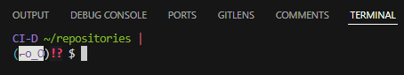
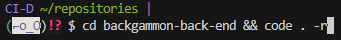
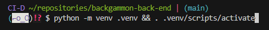

# Name of project

## Live Site

[Tactical Rashers API](https://tactical-rashers-api-50ab26b13e4f.herokuapp.com/)

## Repository

[backgammon-back-end](https://github.com/DaveyJH/backgammon-back-end)

***

## Table of Contents

- [Name of project](#name-of-project)
  - [Live Site](#live-site)
  - [Repository](#repository)
  - [Table of Contents](#table-of-contents)
  - [Objective](#objective)
  - [Brief](#brief)
    - [Tactical Rashers API](#tactical-rashers-api)
  - [UX − User Experience Design](#ux--user-experience-design)
    - [User Requirements](#user-requirements)
      - [First Time User](#first-time-user)
      - [Returning User](#returning-user)
    - [Initial Concept](#initial-concept)
  - [Features](#features)
    - [Existing Features](#existing-features)
    - [Features Left to Implement](#features-left-to-implement)
  - [Database Model](#database-model)
  - [Technologies Used](#technologies-used)
    - [Python Packages](#python-packages)
    - [Other Tech](#other-tech)
      - [*Windows Snipping Tool*](#windows-snipping-tool)
      - [*Visual Studio Code*](#visual-studio-code)
      - [VSCode Extensions](#vscode-extensions)
  - [Testing](#testing)
    - [Manual Testing](#manual-testing)
    - [Automated Testing](#automated-testing)
      - [PEP8 Testing](#pep8-testing)
      - [HTML, CSS and JavaScript](#html-css-and-javascript)
  - [Bugs](#bugs)
    - [Current](#current)
    - [Resolved](#resolved)
  - [Development](#development)
    - [GitHub](#github)
    - [VSCode](#vscode)
      - [Development `.env`](#development-env)
  - [Deployment](#deployment)
  - [Credits](#credits)
    - [Media](#media)
    - [Acknowledgements](#acknowledgements)
    - [Personal Development](#personal-development)

***

## Objective

This site is to represent capabilities with the Django Rest Framework. It should
employ full Create, Read, Update, Delete (CRUD) functionality via DRF.

The assessment checklist is available to view in the
[`docs/` directory](https://github.com/DaveyJH/backgammon-back-end/tree/main/docs)
of the project repository.

***The needs within this project are not genuine and are made purely for the
purpose of completing my Code Institute project.***

***

## Brief

### Tactical Rashers API

Tactical Rashers : a backgammon players' site.  

The site should allow users to play backgammon in a manner similar to
["Chess by post"](https://en.wikipedia.org/wiki/Correspondence_chess). Users
will be able to play private games, with dice rolls handled via the app, and
comment with their intended moves. They should be able to update the main image
of the game to the latest state of a board and should be able to declare a
winner.

Full CRUD functionality should be available to allow users to interact
appropriately with the various aspects of the finished application. This repo
intends to provide a robust back-end API via the Django Rest Framework.

***

## UX &#8722; User Experience Design

### User Requirements

Some example user stories that will affect the design. Please consult the
[GitHub project board](https://github.com/users/DaveyJH/projects/8/views/4) for
a full list.

Below is a non-exhaustive list of some of the user stories. These are the key
user stories that must be achieved for an MVP to be considered complete:

#### First Time User

> *"As a **potential player**, I would like to be able to **read the rules of
> the game** so that I **know how to play**"*
>
> *"As a **potential user**, I would like to be **able to create a profile** so
> that I **am able to play**"*

#### Returning User

> *"As a **returning user**, I would like to **quickly determine whether I am
> logged in** so that I can **log in / out as needed**"*
>
> *"As a **returning user**, I would like to **log in to my account** so that I
> can **interact with the features of the site**"*
>
> *"As a **returning user**, I would like to **view my currently active games**
> so that I can **track the progress of, and make new moves on, my games in
> play**"*
>
> *"As a **returning user**, I would like **to play a game with another
> player** so that I can **enjoy the game of backgammon**"*
>
> *"As a **returning user**, I would like **to comment on completed games** so
> that I can **interact with other users of the site**"*

***

### Initial Concept

The back-end API should provide robust, well-handled database management for the
front-end application. It should allow user authentication, game management,
dice rolling and winner tracking. An optional consideration of "Follow gamer" -
a feature that allows users to follow completed games of particular gamers - may
be considered dependent on time constraints.

***

## Features

### Existing Features

<!-- - Feature 1 - allows users X to achieve Y, by having them fill out Z -->
<!-- 1. feature1
>*"User... **story quote**"*
- *explanation*-->
F1
***
<!-- - Feature 2 - allows users X to achieve Y, by having them fill out Z -->
<!-- 1. feature2
>*"User... **story quote**"*
- *explanation*
  
-->
F2
***

### Features Left to Implement

<!-- features left to implement -->
<!-- 1. Explain desired feature 1
  - *Notes regarding feature*
  - Explanation of feature need etc. -->
<!-- 2. Explain desired feature 2
  - *Notes regarding feature*
  - Explanation of feature need etc. -->
***

## Database Model

A PostgreSQL database has been used for storing the various data required for
the API.

The database structure has been mapped out using an ERD diagram generated using
the [drawio](#vscode-extensions) extension in VSCode. Many of the entities will
be linked back through the owner (Django auth's `User` model) which allows the
database to have a straightforward structure. A few fields are missing from the
ERD that record creation times and update times.

### Production Database

During development, the SQLite3 database provisioned by Django has been used.
For the production build, an external PostgreSQL instance is necessary. Code
Institute has provided a tool for their students that provides such a database.
As the tool is only for students, and the steps are well defined within the
application, the procedure to create this has not been detailed here. The URL
provided via the tool meets the format required for the `dj-database-url`
package: `postgres://<username>:<password>@<host>/<database_name>`

*Many other PostgreSQL hosts will provide a URL in this format if required.*

This URL is used in any non-development environment and is set as the
`DATABASE_URL` environment variable.

***

## Technologies Used

### Python Packages

Some of the main packages used throughout the project:

|         Package          |                       Use                        |
|-------------------------:|--------------------------------------------------|
|[django](https://www.djangoproject.com/)|web framework with effective PostgreSQL database handling methods|
|[djangorestframework](https://www.django-rest-framework.org/)|powerful and flexible toolkit for building Web APIs|
|[djangorestframework-simplejwt](https://www.django-rest-framework.org/)|JSON Web Token authentication plugin|
|[django-filter](https://pypi.org/project/django-filter/)|allow `QuerySet` filtering from URL parameters|
|[cloudinary](https://pypi.org/project/cloudinary/)|easy uploading of media files to Cloudinary|
|[load-dotenv](https://pypi.org/project/load-dotenv/)|reads key-value pairs from a `.env` file|
|[gunicon](https://pypi.org/project/gunicorn/)|Python WSGI HTTP Server for UNIX|
|[psycopg2](https://pypi.org/project/psycopg2/)|PostgreSQL database adapter for Python|
|                          |                                                  |

*For a full list of installed Python packages, see
[`requirements.txt`](https://github.com/DaveyJH/backgammon-back-end/blob/main/requirements.txt)*

Most packages have relevant documentation hosted on the
[Python package index](https://pypi.org/) site.

### Other Tech

<!-- #### ScreenToGif -->

#### *[Windows Snipping Tool](https://support.microsoft.com/en-us/windows/use-snipping-tool-to-capture-screenshots-00246869-1843-655f-f220-97299b865f6b)*

A screenshot tool built into Windows. It allows quick, partial screenshots
to be taken that can be saved as image files.

#### *[Visual Studio Code](https://code.visualstudio.com/)*

A free, streamlined code editor. The [extensions](#vscode-extensions)
available have allowed me to customize my workspace and become more
efficient.

#### VSCode Extensions

Links to the VSCode marketplace for each extension used throughout this project:

- [Python](https://marketplace.visualstudio.com/items?itemName=ms-python.python)
- [Better Comments](https://marketplace.visualstudio.com/items?itemName=aaron-bond.better-comments)
- [GitHub Pull Request and Issue Provider](https://marketplace.visualstudio.com/items?itemName=GitHub.vscode-pull-request-github)
- [Highlight Matching Tag](https://marketplace.visualstudio.com/items?itemName=vincaslt.highlight-matching-tag)
- [Markdown All in One](https://marketplace.visualstudio.com/items?itemName=yzhang.markdown-all-in-one)
- [markdownlint](https://marketplace.visualstudio.com/items?itemName=DavidAnson.vscode-markdownlint)
- [Reflow Markdown](https://marketplace.visualstudio.com/items?itemName=marvhen.reflow-markdown)
- [flake8](https://marketplace.visualstudio.com/items?itemName=ms-python.flake8)
- [Code Spell Checker](https://marketplace.visualstudio.com/items?itemName=streetsidesoftware.code-spell-checker)
- [Django](https://marketplace.visualstudio.com/items?itemName=batisteo.vscode-django)
- [Draw.io](https://marketplace.visualstudio.com/items?itemName=hediet.vscode-drawio)

## Testing

### Manual Testing

Manual testing was performed during the development cycle. As the database is
fairly straightforward, there were very few bugs identified during the process.
Testing consisted of logically creating, reading, updating and deleting records
where necessary. Multiple users were created to allow testing of various
relationships between the models.

### Automated Testing

The nature of the project allowed for fairly robust automated testing. Several
tests were written utilising the `APITestCase` class available through
`rest_framework.test`. I was not aware of how straightforward the test-writing
procedure would be for the application and would consider a TDD approach for
future development. There were a few items that needed editing that were
identified during the writing of tests. Those items have been updated.

Tests were written in a logical order so as to allow the flow of the site to be
written during the process. This allowed functions to be used to create users
and games, reducing the need to duplicate code. However, many lines of code are
similar in the tests and this is done with intention. The tests are clear,
thorough, and easily maintained separately from each other.

Please consult the `test.py` files for the test code, and consult
[the `manage.py test` output file for all tests run](./docs/automated-tests.md).
As shown within that file, 83 tests have been run on the database covering a
wide range of functionality and defensive programming. The test time is fairly
long due to the `DiceRolls` test that ensures dice rolls are random. I could not
think of a more efficient (or certain) way of testing this feature, so 25 dice
rolls are generated and compared for uniqueness and their correct parameters.

#### PEP8 Testing

The Python files have all been checked using [flake8](#vscode-extensions). As
shown, the command `flake8 . --exclude .venv/,__pycache__/,**/migrations/**` was
used to run a check on the entire project directory, excluding the directories
passed in as arguments. No other errors or warnings are reported.  

Doc strings and comments are included where I feel the logic or code needs
explaining beyond its implicit readability, with closing brackets clearly
showing where arguments etc. are finished. The only exceptions to this are the
migration files which were generated by Django.

#### HTML, CSS and JavaScript

No HTML, CSS or JavaScript validation has been carried out on the API front end
as this will not be utilised in the final project and is not my own code.

## Bugs

### Current

At the time of deployment, no current bugs have been found. Some features are
yet to be implemented, but all functionality is working as intended for this
iteration.

***

### Resolved

1. Winner relationships were incorrect

*Commit -
**[a925c74](https://github.com/DaveyJH/backgammon-back-end/blob/a925c74b4500b2c6c284b22b54b080d4091838e3/winners/models.py)***

During manual testing and the improvement of back-end defensive programming, it
became evident that the `Winner` model was incorrectly configured. This was
resolved by implementing a `ForeignKeyField` with `unique=True`. This generates
a warning that a `OneToOneField` is more appropriate, but that would not allow
for a `Game` with no `Winner` without allowing it the other way as well
(`Winner` without a `Game`).  
The warning (`fields.W342`) has been silenced in the `settings.py`
file [***[421eb47](https://github.com/DaveyJH/backgammon-back-end/commit/421eb473e0b724bfe28079a498983ddc6d09a34d)***].

***

*Commit - **[c64e2aa](https://github.com/DaveyJH/backgammon-back-end/commit/c64e2aa3a1d6a8ac6075b3e74219742609b9b326#diff-acc9f5d2892f3a2255a022dc3d77e88d81eb60bb3b1d0e6271a1dd3b0629815eL25-L26)***

During the creation of automated tests, it was identified that players could
potentially create games that did not include themselves as a participant.
Although this is not a breaking issue, and would likely require some front-end
code manipulation when submitting a request, it was simple enough to resolve
with the addition of a custom `perform_create` method. The discovery of this bug
led to another few custom methods being written to prevent erroneous instances
from being created. The image below shows a `Move` being added to a game in
which the author was not a participant.

***

## Development

The site was developed using [git](https://git-scm.com/), [GitHub](#github) and
[VSCode](#vscode). The repository is available for cloning or forking but no
additional contributions will be accepted at this time.

To clone the repo please see the steps below.

### [GitHub](https://github.com)

- Sign in to GitHub.

- Navigate to the repository at https://github.com/DaveyJH/backgammon-back-end,
  click **&#60;&#62; Code &#9662;** and copy the URL provided.

- Proceed to your chosen method of cloning a repo and provide the copied URL
  when needed.

### [VSCode](https://code.visualstudio.com/)

I have a number of extensions installed to aid my development in VSCode. The
steps below work for me, but alternative methods are available. Please consult
the relevant docs for various approaches.

- Open a `bash` terminal within VSCode and navigate to a parent directory for
  your repository.

- Enter `git clone https://github.com/DaveyJH/backgammon-back-end.git` (the URL
  copied from GitHub). This will clone the repository into a new
  directory called `backgammon-back-end`.

- Enter the command `cd backgammon-back-end code . -r` to open the repository in
  the current VSCode window.

- Create and activate a virtual environment within the directory. I use `venv`
  for this via `python -m venv .venv && . .venv/scripts/activate`.

- Install the requirements for the repository using
  `pip install -r requirements.txt`.

- Ensure you have created the necessary `env` variables in a `.env` file.

#### Development `.env`

As mentioned above in the [Python packages](#python-packages) section, I
utilised a `.env` file for my environment variables. If you intend to run this
application from a clone of the repository, you will need your own file with the
following key-value pairs:

|        key           |        value                                         |
|----------------------|------------------------------------------------------|
|SECRET_KEY            | a secret key - this can be generated using `python -c 'from django.core.management.utils import get_random_secret_key; print(get_random_secret_key())'` within your terminal|
|HOST                  |the IP address or host name where the server will be run|
|CLOUDINARY_URL        |a Cloudinary account API Environment variable, available from a Cloudinary account dashboard|
|DEVELOPMENT           |*optional* configures the authentication method of the django rest framework API and connects the django project to an db.sqlite3 instance for use in a development environment|
|DEV                   |*optional* configures the response format of the django rest framework API to allow a front-end interactive representation|
|CLIENT_ORIGIN_DEV     |*optional* allows cross-site http requests from an alternate URL to the server|

*Additional key-value pairs are required for a deployed application. Please see
the section below for more detail*

## Deployment

<!-- !check this section, may need adjusting as using additional languages -->

<!-- **Github Pages**
- Navigate to the relevant GitHub Repository [here](github repo URL)
- Select "Settings" from the options below the name of the repository

- Select "Pages" from the left hand menu

- Select "Branch: main" as the source and leave the directory as "/(root)"

- Click the Save button

- Take note of the URL provided

- GitHub takes a short while to publish the page. The bar turns green if you refresh the pages tab and the page has been deployed

- Click the link or copy the URL to a browser to reach the deployed page
https://daveyjh.github.io/ci-portfolio-one-v4/

The site is now live and operational -->
***

## Credits

### Media

- The default profile image is
  [Two dice image by rawpixel.com on Freepik](https://www.freepik.com/free-vector/illustration-summer-beach-object_2825295.htm#fromView=search&page=1&position=35&uuid=7af1b0c9-0057-4517-95e7-a4f45d178e31)
- The default game image was created by me in Microsoft Paint! (⌐■_■)
- The ERD diagram was made using [drawio](#vscode-extensions)

### Acknowledgements

Thanks to [@CluelessBiker](https://github.com/CluelessBiker), my mentor for the
project, as she helped me focus on the MVP and gave great support regarding the
project planning process.

As always, the wonderful staff at [Code Institute](https://codeinstitute.net/)
for introducing me to this framework and providing me with the foundations to
start developing this API.

***

### Personal Development

I am pleased with how quickly this project has gone together. I would enjoy
working with the framework again and would approach things with a TDD mindset!
